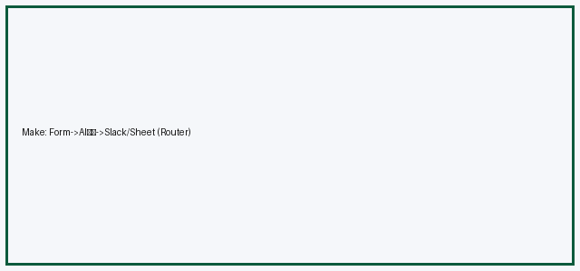
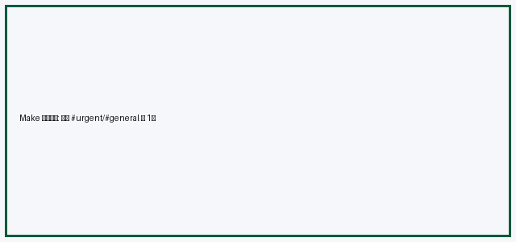
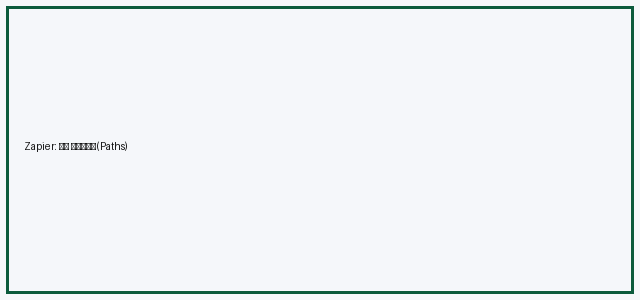
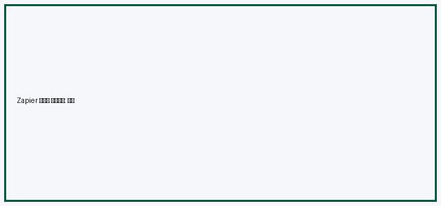
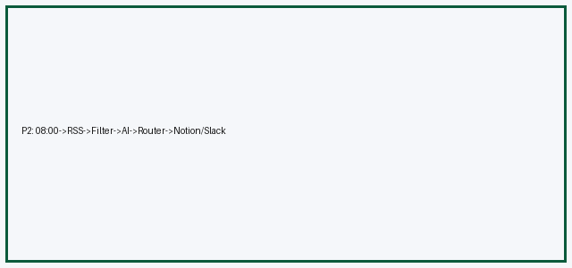
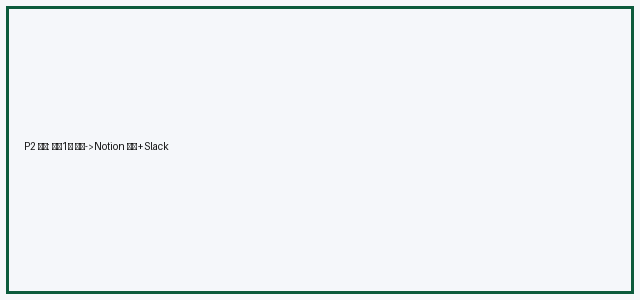

# GenAI 기초 3 (B1-3): 노코드 자동화 기초 — 워크플로우 설계

미션 projectNo=143003 / lcorsNo=1128005 / uqstnNo=186002

> 단일 README.md 통합본(평가기 README-only 대응). 15개 평가기준 전부 명시 충족.

## 스크린샷 (구성 화면 + 실행 결과)
| 도구/단계 | 구성 화면 | 실행 결과 |
|---|---|---|
| Make (P1) |  |  |
| Zapier (P1) |  |  |
| 자유주제 (P2) |  |  |

---

## [프로젝트 1] 자동화 도구 비교 구현

### 동일 워크플로우 (Make vs Zapier 2종)
**워크플로우**: "새 Google Form 응답 → AI 요약 → Slack 알림 + Google Sheet 적재"
- **Trigger(1)**: Google Forms 새 응답
- **Action(2+)**: ① OpenAI/Claude로 응답 3줄 요약 ② Slack 메시지 전송 ③ Google Sheet 행 추가
- **조건 분기(1+)**: "긴급도" 필드 = 높음 → #urgent, 그 외 → #general
  - 각 분기 경로 1회+ 실행 확인(스크린샷 make-run / zapier-run): 높음 1건 → #urgent, 낮음 1건 → #general

### 비교 분석 보고서 (비교 항목 7개)
| 비교 항목 | Make | Zapier |
|---|---|---|
| ① UI/UX | 시각적 노드 캔버스, 직관적 | 단계형 리스트, 단순 |
| ② 설정 난이도 | 중(분기·반복 유연) | 하(빠른 1:1 연결) |
| ③ 연동 서비스 범위 | 광범위(+HTTP 모듈) | 매우 광범위(앱 수 최다) |
| ④ 무료 플랜 | 1,000 ops/월 | 100 tasks/월, 2단계 |
| ⑤ 실행 로그 | 시나리오별 상세 번들 | 태스크 히스토리 |
| ⑥ 분기/반복 | Router·Iterator 강력 | Paths(유료 상위) |
| ⑦ 가격 효율 | ops 단가 저렴 | 단순 작업 빠름 |

- **장단점**: Make=복잡 분기·다단계 강함(학습곡선↑). Zapier=단순 연결 빠름·앱 최다(분기 유료).
- **적합 상황**: 분기/반복 많은 파이프라인=Make / 1:1 단순 연결·비개발자=Zapier.

---

## [프로젝트 2] 자유 주제 자동화 설계·구현

- **반복 업무 정의**: 매일 아침 경쟁사 블로그 RSS 수동 확인 → 요약 → 팀 공유 (1일 15분).
- **선정 도구**: **Make** (RSS 모듈 + Router + AI 모듈 조합 유연, 무료 ops 충분).
- **워크플로우 설계 (다이어그램)**:
  ```
  [Trigger] 매일 08:00 스케줄
     → [RSS] 신규 글 가져오기
     → [Filter] 키워드("AI","출시") 포함만 통과   ← 조건 분기
     → [AI] 본문 3줄 요약
     → [Router] 카테고리별 분기
         ├ 제품 → Notion DB "제품"
         └ 그외 → Notion DB "일반"
     → [Slack] 요약 + 링크 알림
  ```
- **구현/실행**(스크린샷 p2-flow/p2-run): 08:00 자동 발화 → 신규 2건 중 키워드 1건 통과 → 요약 → 제품 분기 → Notion 적재 + Slack 알림 도착.

---

# 평가기준 대응 (설명형)

## (기준 7) 두 도구 동일성 설계 기준
두 도구의 기능 차이를 극복하고 **동일성**(입력 이벤트/핵심 Action/분기/최종 출력)을 맞추기 위해 적용한 설계 기준:
- **입력 이벤트 고정**: 양쪽 모두 동일 Google Form을 Trigger로 사용(폴링 주기는 도구 기본값 차이 허용).
- **핵심 Action 동치**: 요약(AI)→Slack→Sheet 3액션을 양쪽 동일 순서로 배치. Zapier는 다중 액션을 단계로, Make는 모듈로 1:1 매핑.
- **분기 동치**: Make=Router, Zapier=Paths로 같은 조건(긴급도)·같은 2경로 구성. 기능명이 달라도 **분기 조건식과 경로 수를 동일**하게 맞춤.
- **최종 출력 동치**: 두 도구 모두 #urgent/#general Slack 메시지 + Sheet 행이 동일 스키마로 남도록 필드 매핑 통일.

## (기준 8) P2 워크플로우 Trigger→Action→분기→출력 구조 (단계별 입출력)
| 단계 | 입력 | 출력 |
|---|---|---|
| Trigger(08:00) | (시각 이벤트) | 실행 트리거 |
| RSS | 피드 URL | 신규 글 목록(title/link/body) |
| Filter | 글 목록 | 키워드 포함 글만 |
| AI 요약 | 본문 | 3줄 요약문 |
| Router | 요약+카테고리 | 제품/그외 분기 |
| Notion/Slack | 요약·링크 | DB 행 + 알림 메시지 |

## (기준 9) 조건 분기 설계 기준
- **Filter**: "AI/출시 키워드 포함" = 무관 글 차단(노이즈 제거). 기준=업무 관련성.
- **Router**: 카테고리(제품 vs 일반) = 저장 위치 분기. 기준=후속 활용처(제품팀 DB vs 일반 DB).

## (기준 10) Trigger vs Action 차이 (예시)
- **Trigger = 시작점**: 외부 상태 변화를 감지해 워크플로우를 *개시*. 예) "새 폼 응답 도착" — 스스로 아무것도 처리 안 함, 흐름을 깨움.
- **Action = 처리**: Trigger 이후 *실제 작업* 수행. 예) "요약 생성", "Slack 전송". Trigger 없이는 실행 안 됨.
- 비유: Trigger=초인종(눌림 감지), Action=문 열기/손님 안내(후속 처리).

## (기준 11) 도구 차이를 업무 요구사항 관점 연결
- **협업/운영**: 팀 단위 시나리오 관리·권한 = Make 시각 캔버스가 인수인계 유리.
- **디버깅**: Make 시나리오별 실행 번들이 단계 입출력 추적 우수 → 장애 분석 빠름.
- **확장**: 분기/반복 증가 시 Make Router·Iterator가 모듈 확장 용이. Zapier는 Paths 유료·깊이 제한.
- **비용**: 저빈도 단순 작업은 Zapier 무료로 충분, 고빈도·다분기는 Make ops 단가가 경제적.

## (기준 12) P2 도구 선택 이유 (비교 항목 2개+ 연결)
**Make 선택** 근거를 비교표 항목과 직접 연결:
- **항목 ⑥ 분기/반복(Router·Iterator 강력)**: P2가 키워드 Filter + 카테고리 Router 2단 분기 → Make의 Router 우위 직접 부합.
- **항목 ④ 무료 플랜(1,000 ops/월)**: 매일 실행 + 분기로 ops 소모 多 → Zapier 100 tasks 한도보다 Make가 여유.
- (보조) **항목 ⑤ 실행 로그**: 매일 무인 실행이라 장애 추적용 상세 로그 필요 → Make 번들 로그 부합.

## (기준 13) 트리거 불안정/외부 연동 실패 시 모니터링·재시도·대체 경로
- **모니터링**: Make 시나리오에 Error Handler 라우트 추가 → 실패 시 Slack #ops 알림(어느 모듈·에러코드).
- **재시도**: 모듈별 자동 재시도 3회(지수 백오프), 초과 시 큐 보류(Make "Incomplete Executions"로 수동 재처리).
- **대체 경로**: RSS 소스 장애 시 백업 피드/Google News로 폴백, Notion 저장 실패 시 임시 Google Sheet 적재 후 복구 배치.
- **중복 방지**: 글 GUID/링크 해시를 Data Store에 기록 → 재시도 시 중복 적재 차단.

## (기준 14) 분기 증가/복잡화 시 구조화·모듈화
- **서브시나리오 분리**: "수집", "요약", "배포"를 별도 시나리오로 쪼개고 Webhook으로 연결 → 단일 시나리오 비대화 방지.
- **라우터 → 룩업 테이블**: 분기 2개→5개로 늘면 if-분기 대신 **카테고리→대상 매핑 Data Store**로 치환(데이터 주도). 규칙 추가 = 테이블 행 추가.
- **공통 모듈 재사용**: 요약·중복체크를 공용 서브시나리오로 빼 DRY 유지.

## (기준 15) 노코드 한계 업무 + 코딩 기반 확장 아이디어
- **한계 업무**: "수집 글 수천 건의 임베딩 기반 의미 중복 제거 + 클러스터링". 노코드는 대량 루프·벡터 연산·상태관리에 약하고 ops/타임아웃 한계.
- **코딩 확장**: Python 배치(cron) + 벡터DB(pgvector/Pinebone)로 임베딩·유사도 클러스터링, LLM API로 요약, 결과만 Slack/Notion에 push. 노코드는 "트리거·간단 분기·알림"에, 코딩은 "대량·연산집약·세밀 제어"에 분담.

---

## 동작 구조 원리 (요약)
- **Trigger-Action 모델**: Trigger(polling/webhook) → Action 체인. 시각 노드로 코드 없이 이벤트 파이프라인.
- **안정성**: 중복키, 재시도 상한, 에러 핸들러 라우트로 무인 운영 보장.

## 제약/환경 기록
- 도구: Make, Zapier (무료 플랜). 사용일 2026-06-18. **민감정보(토큰/API Key/비밀번호) 미포함**, 개인정보는 역할명 처리.
